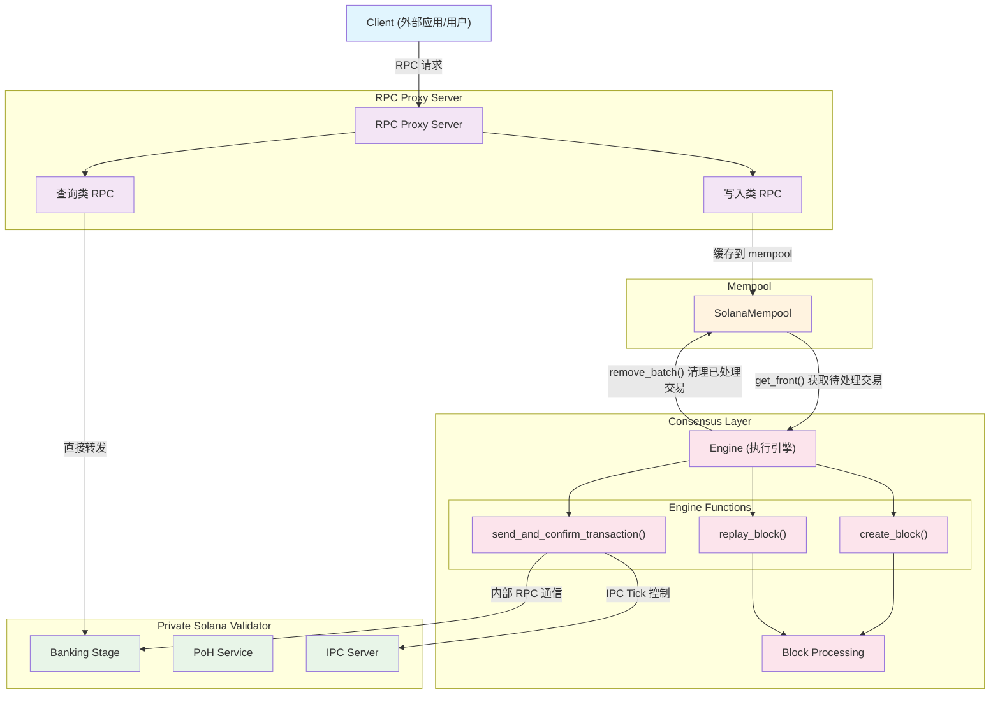

# Multivm-Agave
## 架构



### 组件详细说明

#### RPC Proxy Server
- **查询类 RPC**: getAccountInfo, getBalance, getBlockHeight, getLatestBlockhash, getSignatureStatus, getSlot, getTransaction, simulateTransaction 等
- **写入类 RPC**: send_transaction, request_airdrop

#### Private Solana Validator
- **Banking Stage**: 交易处理层
- **PoH Service**: 时间证明服务
- **IPC Server**: 手动 Tick 控制

#### Mempool (SolanaMempool)
- FIFO 队列操作
- 随机删除功能
- 重复检测机制
- 无容量限制

#### Consensus Layer
- **Engine**: 执行引擎
  - `create_block()`: 批量执行交易、创建区块数据、更新状态
  - `replay_block()`: 验证区块序列、验证区块哈希、重放交易
  - `send_and_confirm_transaction()`: IPC Tick 控制、交易提交、状态确认

### 数据流向说明

1. **Client → RPC Proxy Server**: 外部客户端发送 RPC 请求
2. **RPC Proxy Server → Private Solana Validator**: 查询类 RPC 直接转发到验证器
3. **RPC Proxy Server → Mempool**: 写入类 RPC (send_transaction, request_airdrop) 缓存到 mempool
4. **Consensus Layer → Mempool**: 共识层从 mempool 获取待处理交易 (get_front)
5. **Consensus Layer → Engine**: 调用 create_block/replay_block 处理交易
6. **Engine → Private Solana Validator**: 通过内部 RPC 与验证器通信
7. **Engine → Block Processing**: 处理区块创建和验证
8. **Block Processing → Mempool**: 清理已处理的交易 (remove_batch)

## 核心组件

### 1. Private Validator 启动（已经在 solana-execution-engine 包里了）

主要的验证器可执行文件，基于 Solana TestValidator 构建，但增加了以下关键功能：

- **手动 Tick 控制**: 通过 IPC 接口控制区块链的时间推进
- **确定性模式**: 支持可重现的创世哈希生成

启动方式：

```bash
target/debug/multivm-validator \
  --gossip-host 127.0.0.1 \
  --gossip-port 1024 \
  --ledger /tmp/solana-private-ledger \
  --ticks-per-slot 2 \
  --reset \
  --tick-ipc-path /tmp/solana-private-validator \
  --deterministic
```

参数说明：

- `--gossip-host`: Gossip 网络主机地址
- `--gossip-port`: Gossip 网络端口
- `--ledger`: 账本数据存储路径
- `--ticks-per-slot`: 每个 slot 的 tick 数量，请设置为 2
- `--reset`: 重置现有账本数据
- `--tick-ipc-path`: IPC 通信套接字路径
- `--deterministic`: 启用确定性模式

Tick 设置为 2 是为了 2 个 Tick 出一个块。

### 2. Tick IPC Client

用于与验证器进行 IPC 通信的客户端工具，实现手动控制区块链时间推进。

基本使用：

```rust
use crate::bridge::ipc::IpcClient;

// 创建 IPC 客户端
let client = IpcClient::new("/tmp/solana-private-validator".to_string());

// 发送 tick 命令推进区块链
match client.tick() {
    Ok(success) => {
        if success {
            println!("Tick 成功执行");
        } else {
            println!("Tick 执行失败");
        }
    }
    Err(e) => {
        eprintln!("IPC 通信错误: {}", e);
    }
}
```
### 3. 发送一笔交易的方式（原仓库已经封装好函数）

#### `send_and_confirm_transaction` 函数说明

项目提供了两个版本的 `send_and_confirm_transaction` 函数，用于在手动 tick 控制的环境下发送并确认交易。

##### 1. 默认版本

```rust
pub fn send_and_confirm_transaction(
    tick_client: &IpcClient,     // IPC 客户端，用于手动控制 tick
    rpc_client: &RpcClient,      // RPC 客户端，用于与验证器通信
    transaction: &Transaction,   // 要发送的交易
) -> Result<Signature, Box<dyn std::error::Error + Send + Sync>>
```

**默认配置**:
- 最大重试次数: 60 次
- 轮询间隔: 100ms

##### 2. 自定义配置版本

```rust
pub fn send_and_confirm_transaction_with_config(
    tick_client: &IpcClient,     // IPC 客户端
    rpc_client: &RpcClient,      // RPC 客户端
    transaction: &Transaction,   // 要发送的交易
    max_retries: u32,           // 最大重试次数
    poll_interval: Duration,    // 轮询间隔
) -> Result<Signature, Box<dyn std::error::Error + Send + Sync>>
```

**参数说明**:
- `tick_client`: [`IpcClient`](validator/src/bridge/ipc.rs:253) 实例，负责向验证器发送 tick 命令来推进区块链时间
- `rpc_client`: [`RpcClient`] 实例，用于发送交易和查询交易状态
- `transaction`: 已签名的 [`Transaction`] 对象，包含要执行的指令
- `max_retries`: 交易确认的最大重试次数
- `poll_interval`: 查询交易状态的时间间隔

**函数执行流程**:
1. **交易前 tick**: 在发送交易前先执行一次 tick，让内部产生一次投票交易
2. **发送交易**: 通过 RPC 客户端将交易发送到验证器，获取交易签名
3. **交易后 tick**: 发送交易后连续执行3次 tick，确保交易被包含在区块中，且顺利出块
4. **状态轮询**: 持续查询交易状态直到达到 `Processed` 确认级别
5. **错误处理**: 提供详细的错误信息和重试机制，超时后返回错误

**使用示例**:

```rust
pub fn test_airdrop() {
    // 创建客户端连接
    let tick_client = IpcClient::new("/tmp/solana-private-validator".to_string());
    let rpc_client = RpcClient::new("http://127.0.0.1:8899".to_string());

    // 创建 faucet keypair (发送方，Airdrop)
    let faucet_keypair = super::faucet_keypair();

    // 创建一个随机的接收方账户
    let to_keypair = Keypair::new();
    let to_pubkey = to_keypair.pubkey();

    // 转账金额 (1 SOL)
    let transfer_amount = 1_000_000_000;

    // 创建转账指令
    let transfer_instruction =
        system_instruction::transfer(&faucet_keypair.pubkey(), &to_pubkey, transfer_amount);

    // 获取最新的 blockhash
    let recent_blockhash = match rpc_client.get_latest_blockhash() {
        Ok(blockhash) => blockhash,
        Err(e) => {
            println!("Failed to get latest blockhash: {}", e);
            return;
        }
    };

    // 创建交易
    let mut transaction =
        Transaction::new_with_payer(&[transfer_instruction], Some(&faucet_keypair.pubkey()));

    // 签名交易
    transaction.sign(&[&faucet_keypair], recent_blockhash);

    // 发送并确认交易
    match send_and_confirm_transaction(&tick_client, &rpc_client, &transaction) {
        Ok(signature) => {
            println!(
                "✅ Airdrop successful! Transaction signature: {}",
                signature
            );
            println!(
                "Transferred {} lamports from {} to {}",
                transfer_amount,
                faucet_keypair.pubkey(),
                to_pubkey
            );
        }
        Err(e) => {
            println!("❌ Airdrop failed: {}", e);
        }
    }
}
```

### 4. Mempool 与 RPC（已经在 solana-execution-engine 包里了）

#### RPC Proxy Server 架构

项目实现了一个 RPC Proxy Server，作为客户端和 Solana 验证器之间的中间层，提供智能路由和交易管理功能。

#### RPC 请求路由机制

##### 直接转发的 RPC 方法
大部分 RPC 请求会被直接转发到 Solana 验证器，包括但不限于：
- `getAccountInfo` - 获取账户信息
- `getBalance` - 获取账户余额
- `getBlockHeight` - 获取区块高度
- `getLatestBlockhash` - 获取最新区块哈希
- `getSignatureStatus` - 获取交易状态
- `getSlot` - 获取当前 slot
- `getTransaction` - 获取交易详情
- `simulateTransaction` - 模拟交易执行
- 其他查询类 RPC 方法

**转发流程**:
```
Client Request → RPC Proxy → Solana Validator → Response → Client
```

##### 特殊处理的 RPC 方法

###### 1. `request_airdrop`
空投请求不会直接发送到验证器，而是进入 mempool 处理：

```
Client → request_airdrop → RPC Proxy → Mempool → 等待共识处理
```

**处理逻辑**:
1. 接收客户端的空投请求
2. 创建相应的转账交易
3. 将交易添加到 mempool 中
4. 返回交易签名给客户端
5. 等待共识层从 mempool 中取出并执行

###### 2. `send_transaction`
交易发送请求同样进入 mempool 而非直接转发：

```
Client → send_transaction → RPC Proxy → Mempool → 等待共识处理
```

**处理逻辑**:
1. 接收客户端提交的已签名交易
2. 验证交易格式和签名
3. 将交易添加到 mempool 队列
4. 返回交易签名给客户端
5. 交易在 mempool 中等待被共识层处理

#### Mempool 交易管理

##### Mempool 数据结构

项目实现了 `SolanaMempool`，支持随机删除的高效交易池：

```rust
/// 支持随机删除的 Solana Mempool
#[derive(Debug)]
pub struct SolanaMempool {
    /// 使用 IndexMap 存储交易，保持插入顺序同时支持快速随机访问
    /// Key: 交易签名, Value: mempool 条目
    transactions: IndexMap<Signature, MempoolEntry>,
}

/// Mempool 中的交易条目
#[derive(Debug, Clone)]
pub struct MempoolEntry {
    /// 交易数据
    pub transaction: SanitizedTransaction,
    /// 交易签名（用作唯一标识符）
    pub signature: Signature,
}
```

##### 核心特性

1. **FIFO 队列操作**: 支持按插入顺序获取前 n 项交易
2. **随机删除**: 支持根据签名快速删除任意交易
3. **无容量限制**: 可以无限制地添加交易
4. **重复检测**: 自动检测并拒绝重复的交易签名

##### 主要 API 方法

###### 交易入队
```rust
// 向 mempool 添加交易
pub fn push(&mut self, transaction: SanitizedTransaction) -> Result<(), String>
```

**入队流程**:
1. 创建 `MempoolEntry` 包装交易
2. 检查交易签名是否已存在（防重复）
3. 将交易插入 `IndexMap` 保持 FIFO 顺序
4. 记录调试日志

###### 批量获取交易
```rust
// 获取队列前 n 项交易（不删除元素）
pub fn get_front(&self, count: usize) -> Vec<&MempoolEntry>
```

**获取特性**:
- 按 FIFO 顺序返回交易
- 不会从 mempool 中删除交易
- 如果请求数量超过可用交易，返回所有可用交易

###### 随机删除交易
```rust
// 根据签名随机删除交易
pub fn remove(&mut self, signature: &Signature) -> Option<MempoolEntry>

// 批量移除多个交易
pub fn remove_batch(&mut self, signatures: &[Signature]) -> Vec<MempoolEntry>
```

**删除特性**:
- 支持根据签名精确删除任意交易
- 支持批量删除操作
- 删除后自动维护 FIFO 顺序

##### Mempool 交易处理流程

###### 1. 交易入队（来自 RPC）
```rust
// RPC Proxy 接收到 send_transaction 或 request_airdrop
let sanitized_tx = SanitizedTransaction {
    signature: transaction.signatures[0],
    raw_body: serialize_transaction(&transaction),
};

// 添加到 mempool
match mempool.push(sanitized_tx) {
    Ok(_) => info!("Transaction added to mempool"),
    Err(e) => warn!("Failed to add transaction: {}", e),
}
```

###### 2. 共识层获取交易
```rust
// 共识层需要创建区块时获取交易批次
let batch_size = 100; // 每个区块的最大交易数
let pending_txs = mempool.get_front(batch_size);

// 转换为可执行的交易格式
let mut transactions: Vec<Transaction> = pending_txs
    .iter()
    .map(|entry| deserialize_transaction(&entry.transaction.raw_body))
    .collect();
```

###### 3. 交易执行和清理
```rust
// 执行交易并创建区块
let block = engine.create_block(&mut transactions).await?;

// 从 mempool 中移除已处理的交易
let processed_signatures: Vec<Signature> = transactions
    .iter()
    .map(|tx| tx.signatures[0])
    .collect();

let removed_entries = mempool.remove_batch(&processed_signatures);
info!("Removed {} processed transactions from mempool", removed_entries.len());
```

### 5. 接收一个区块（已经在 solana-execution-engine 包里了，里面也有 example）

#### `create_block` 函数说明

该函数用于通过 RPC 向验证器提交多个已签名的交易，并创建一个包含这些交易的区块。

**函数签名**:
```rust
pub async fn create_block(
    &self,
    transactions: &mut [Transaction],  // 要提交的已签名交易数组
) -> Result<SolanaBlockData, SolanaEngineError>
```

**参数说明**:
- `transactions`: 已签名的 [`Transaction`] 对象数组，按顺序提交到验证器

**返回值**:
- `Ok(SolanaBlockData)`: 包含成功提交交易的区块数据
- `Err(SolanaEngineError)`: RPC 客户端未初始化或其他错误

#### 函数执行流程

1. **空交易处理**: 如果交易数组为空，创建一个空区块并更新状态
2. **顺序提交交易**: 按数组顺序逐个提交交易到验证器
3. **错误处理**: 记录失败的交易，但继续处理其他交易
4. **区块创建**: 基于成功的交易创建区块数据
5. **状态更新**: 更新当前 slot 和区块哈希

#### 区块数据结构

创建的 `SolanaBlockData` 包含以下信息：

```rust
SolanaBlockData {
    slot: next_slot,                    // 新区块的 slot 号
    block_hash,                         // 区块哈希值
    parent_slot: current_slot,          // 父区块的 slot 号
    transactions: successful_transactions, // 成功的交易列表
    block_time: Some(block_time),       // 区块时间戳
    previous_blockhash,                 // 前一个区块的哈希
}
```

#### 使用示例

```rust
// 准备多个已签名的交易
let mut transactions = vec![signed_tx1, signed_tx2, signed_tx3];

// 创建区块
match engine.create_block(&mut transactions).await {
    Ok(block) => {
        println!("✅ 区块创建成功!");
        println!("Slot: {}", block.slot);
        println!("区块哈希: {:?}", block.block_hash);
        println!("包含交易数: {}", block.transactions.len());
    }
    Err(e) => {
        println!("❌ 区块创建失败: {}", e);
    }
}
```

#### 关键特性

- **批量处理**: 支持一次性提交多个交易
- **容错机制**: 单个交易失败不会影响整个区块的创建
- **状态管理**: 自动更新 slot 和区块哈希状态
- **时间戳**: 为每个区块分配准确的时间戳
- **哈希计算**: 基于交易内容、slot 和时间戳计算区块哈希

### 6. 重放一个区块（已经在 solana-execution-engine 包里了，里面也有 example）

#### `replay_block` 函数说明

该函数用于通过 Solana 验证器重放一个区块。区块必须按顺序接收（slot n+1 在 slot n 之后）。

**函数签名**:
```rust
pub async fn replay_block(
    &mut self,
    block: SolanaBlockData,  // 要重放的区块数据
) -> Result<bool, SolanaEngineError>
```

**参数说明**:
- `block`: [`SolanaBlockData`] 对象，包含要重放的区块信息

**返回值**:
- `Ok(true)`: 重放成功
- `Ok(false)`: 重放失败但没有致命错误
- `Err(SolanaEngineError)`: 发生致命错误（如序列错误、哈希验证失败等）

#### 函数执行流程

1. **序列验证**: 验证区块必须按顺序接收（slot n+1 在 slot n 之后）
2. **哈希验证**: 重新计算区块哈希并与提供的哈希进行比较
3. **区块提交**: 将区块中的所有交易提交到 Solana 验证器
4. **状态更新**: 更新当前 slot 和处理统计信息
5. **性能记录**: 记录处理时间和交易数量

#### 验证机制

##### 序列验证
```rust
let expected_slot = current_slot + 1;
if slot != expected_slot {
    return Err(SolanaEngineError::Configuration(format!(
        "Block sequence error: expected slot {}, but received slot {}",
        expected_slot, slot
    )));
}
```

##### 哈希验证
```rust
let computed_hash = compute_block_hash(&block.transactions, slot, previous_blockhash, block_time);
if computed_hash != block_hash {
    return Err(SolanaEngineError::Configuration(format!(
        "Block hash verification failed for slot {}: expected {:?}, but computed {:?}",
        slot, block_hash, computed_hash
    )));
}
```

#### 辅助函数

##### `submit_block_to_validator`
负责将区块中的所有交易提交到验证器：
- 逐个提交区块中的每个交易
- 记录成功和失败的交易数量
- 提供详细的日志记录

##### `submit_transaction_to_validator`
负责提交单个交易到验证器：
- 使用 `send_and_confirm_transaction` 进行交易提交
- 集成 tick 机制确保交易被正确处理
- 返回交易签名

#### 使用示例

```rust
// 准备要重放的区块数据
let block_data = SolanaBlockData {
    slot: 123,
    block_hash: computed_hash,
    parent_slot: 122,
    transactions: vec![tx1, tx2, tx3],
    block_time: Some(timestamp),
    previous_blockhash: parent_hash,
};

// 重放区块
match engine.replay_block(block_data).await {
    Ok(true) => {
        println!("✅ 区块重放成功!");
    }
    Ok(false) => {
        println!("⚠️ 区块重放失败，但可以继续");
    }
    Err(e) => {
        println!("❌ 区块重放发生致命错误: {}", e);
    }
}
```